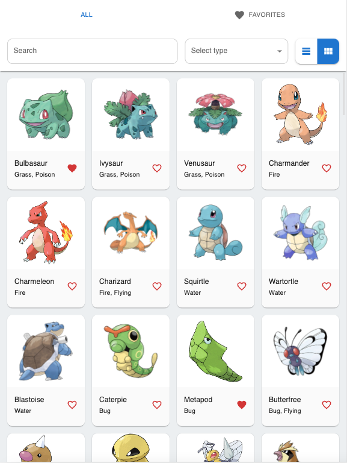
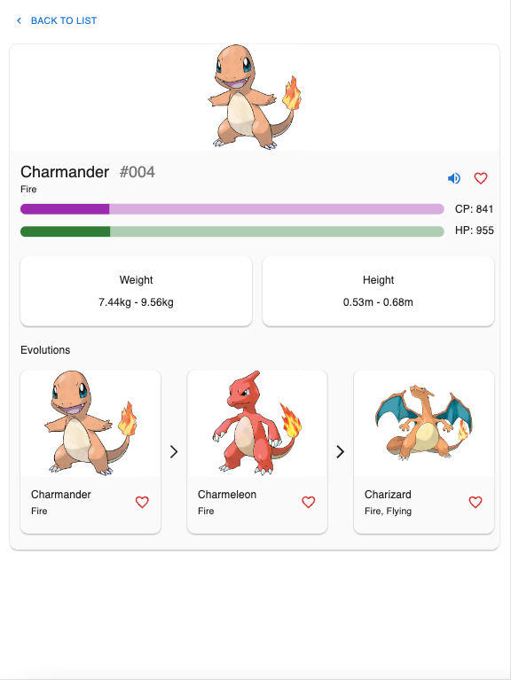
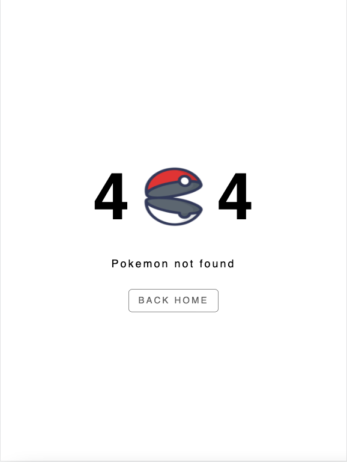

This project is built with [Next.js](https://nextjs.org/docs/getting-started). The UI library is [Material UI](https://mui.com/material-ui/getting-started/overview/) and I used [Apollo Client](https://www.apollographql.com/docs/react/) for GraphQL and state management.

## The Pokedex

This project is visible at https://pokedex-tc.web.app/ hosted by [Firebase](https://firebase.google.com/).

|                    Home                     |                    Detail                     |                    404                    |
| :-----------------------------------------: | :-------------------------------------------: | :---------------------------------------: |
|  |  |  |

## Run the repo

To run the project locally:

```bash
# Build & run production version for better performance
npm i && npm run build && npm start
# or run dev server
npm i && npm run dev
```

Open [http://localhost:3000](http://localhost:3000) with your browser to see the result.

## Relevant test results

### A11y

- axe passes with no critical or serious errors

### Code

- React testing library is [setup](https://nextjs.org/docs/testing#jest-and-react-testing-library).
- I did not have time to do complehensive testing. However two tests have been created for demo purpose:
  - utils/sortById
  -

## Browsers and screen sizes tested

- Browser: Chrome (106)
- Screen sizes w/ Chrome device toolbar:
  - sm (375, 390)
  - md (667, 768, 844)
  - lg (1024, 1180, 1280+)
